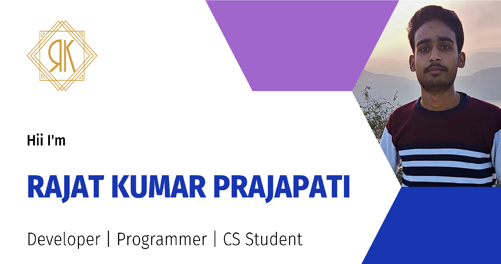

[][website]

## I'm a Developer !!

- 👀 I’m interested in Ethical Hacking, App development and Web
- 🌱 I’m currently learning Webdevelopment and Ethical Hacking
- 🌱 I’m currently learning everything 🤣
- 👯 I’m looking to collaborate with other content creators
- 🥅 2022 Goals: Contribute more to Open Source projects
- ⚡ Fun fact: I love to learn.

### Connect with me:

 

 
 

### Languages:

 
 

 

### Tools and Technology:

 
 
 
 

## Here is My Github Stats

<!---
itsRajatkumar/itsRajatkumar is a ✨ special ✨ repository because its `README.md` (this file) appears on your GitHub profile.
You can click the Preview link to take a look at your changes.
--->

[website]: https://rajatkumar.tech
[twitter]: https://twitter.com/iam_Rkprajapati
[instagram]: https://instagram.com/thisisrajatkumar
[linkedin]: https://linkedin.com/in/thisisrajatkumar
